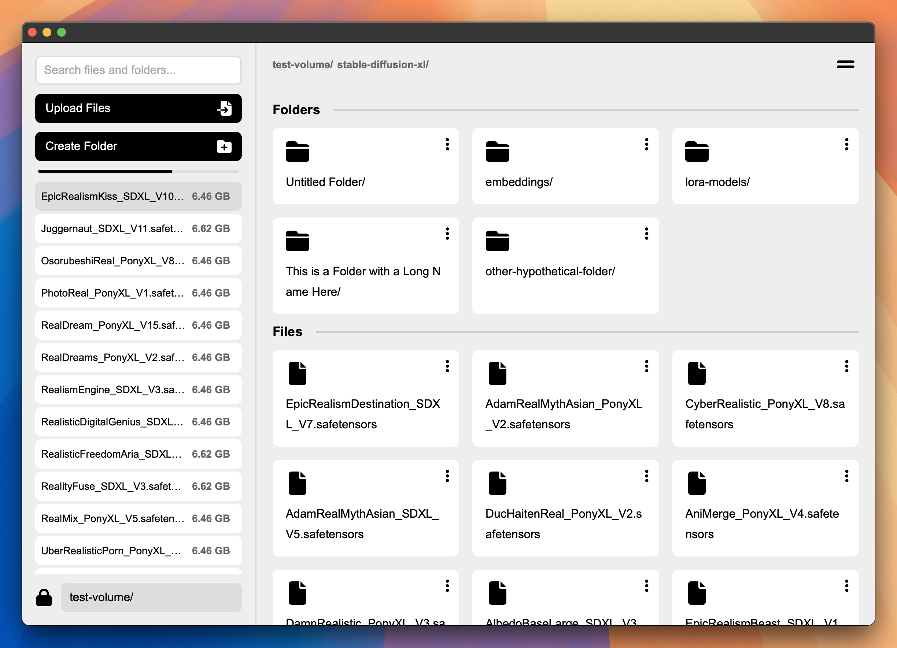

# Network Volume Manager

A modern, web-based file management system for network volumes built with FastAPI and vanilla JavaScript.



## Overview

Network Volume Manager is a lightweight yet powerful web application designed to provide easy access and management capabilities for network-attached storage volumes. It offers an intuitive interface for browsing, uploading, and managing files and folders across your network volumes.

## Features

### Core Functionality
- **File & Folder Management**: Browse, create, rename, move, and delete files and folders
- **File Upload**: Upload files with progress tracking and queue management
- **Search**: Quickly find files and folders with real-time search functionality
- **Volume Mounting**: Change the base directory to access different network volumes

### User Interface
- **Dual View Modes**: Toggle between list and grid views for files and folders
- **Breadcrumb Navigation**: Easy path navigation with clickable breadcrumbs
- **Responsive Design**: Clean, modern interface that works on various screen sizes
- **Selection Mode**: Select multiple files/folders for batch operations

### Advanced Features
- **Batch Operations**: Move or delete multiple files and folders simultaneously
- **Atomic File Operations**: Ensures file integrity during uploads and operations
- **Path Validation**: Prevents unauthorized access outside the mounted volume
- **Error Handling**: Comprehensive error handling with user-friendly messages

## Technology Stack

- **Backend**: FastAPI (Python)
- **Frontend**: Vanilla JavaScript, HTML5, CSS3
- **Server**: Uvicorn ASGI server
- **Templating**: Jinja2
- **File Operations**: Asynchronous I/O with aiofiles

## Installation

### Prerequisites
- Python 3.8 or higher
- pip (Python package installer)

### Setup

1. Clone the repository:
   ```bash
   git clone https://github.com/yourusername/network-volume-manager.git
   cd network-volume-manager
   ```

2. Create and activate a virtual environment (optional but recommended):
   ```bash
   python -m venv venv
   source venv/bin/activate  # On Windows: venv\Scripts\activate
   ```

3. Install dependencies:
   ```bash
   pip install -r requirements.txt
   ```

4. Create a test volume directory (if it doesn't exist):
   ```bash
   mkdir test-volume
   ```

## Usage

### Starting the Application

Run the application with:

```bash
python run.py
```

This will start the server at `http://0.0.0.0:5000`. Access the application by opening a web browser and navigating to:

```
http://localhost:5000
```

### Changing the Base Directory

By default, the application uses a `test-volume` directory in the project root. To change this:

1. Click the lock icon in the bottom left corner of the sidebar
2. Enter the path to your desired directory
3. Click the lock icon again to confirm

#### Environment-Specific Paths:

- **Local Development**: Use `test-volume/` or any local directory
- **RunPod Serverless**: Use `/runpod-volume/` to access the RunPod volume mount

### File Operations

- **Upload Files**: Click the "Upload Files" button or drag and drop files onto the browser area
- **Create Folder**: Click the "Create Folder" button to create a new folder in the current directory
- **Navigate**: Click on folder names to navigate into them, use the breadcrumb navigation to go back
- **File/Folder Actions**: Click the options menu (three dots) next to any file or folder to:
  - Rename
  - Move
  - Delete

### Batch Operations

1. Click the "Select" button in the top right corner to enter selection mode
2. Check the boxes next to files/folders you want to operate on
3. Use the "Delete" or "Move" buttons that appear to perform batch operations
4. Click "Select" again to exit selection mode

### Search

Use the search box in the sidebar to find files and folders across the entire volume. Click on a search result to navigate to its location.

## Security Considerations

- The application validates all paths to ensure they remain within the mounted volume
- File operations use atomic patterns where possible to maintain data integrity
- The application is designed for use in trusted network environments

## Deployment

### RunPod Serverless

When deploying to RunPod Serverless:

1. Ensure your application is configured to use the `/runpod-volume/` path
2. After starting the application, click the lock icon and enter `/runpod-volume/`
3. This will mount the RunPod volume, giving you access to persistent storage

## Development

### Project Structure

```
network-volume-manager/
├── app/
│   ├── __init__.py
│   ├── app.py              # Main FastAPI application
│   ├── static/
│   │   ├── script.js       # Frontend JavaScript
│   │   └── styles.css      # CSS styles
│   └── templates/
│       └── index.html      # HTML template
├── test-volume/            # Default volume directory
├── .gitignore
├── README.md
├── requirements.txt
└── run.py                  # Application entry point
```

### Key Components

- **FileSystem Class**: Handles all file system operations with validation
- **UIManager Class**: Manages the frontend UI and user interactions
- **API Object**: Provides a clean interface for frontend-backend communication

## Contributing

Contributions are welcome! Please feel free to submit a Pull Request.

1. Fork the repository
2. Create your feature branch (`git checkout -b feature/amazing-feature`)
3. Commit your changes (`git commit -m 'Add some amazing feature'`)
4. Push to the branch (`git push origin feature/amazing-feature`)
5. Open a Pull Request

## License

This project is licensed under the MIT License - see the LICENSE file for details.

## Acknowledgments

- FontAwesome for the icons used in the interface
- The FastAPI team for the excellent web framework